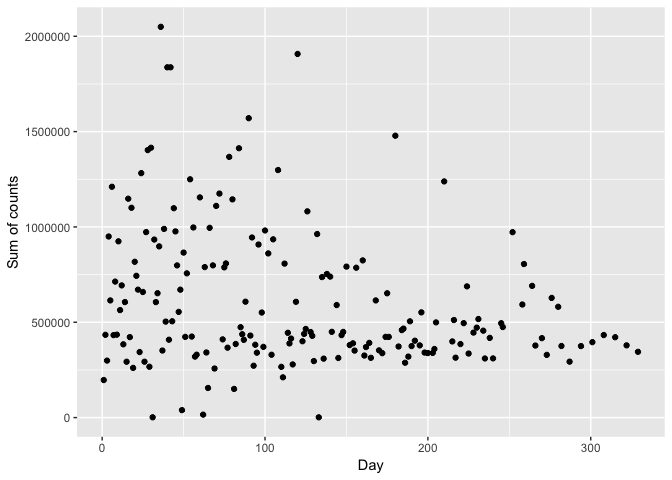
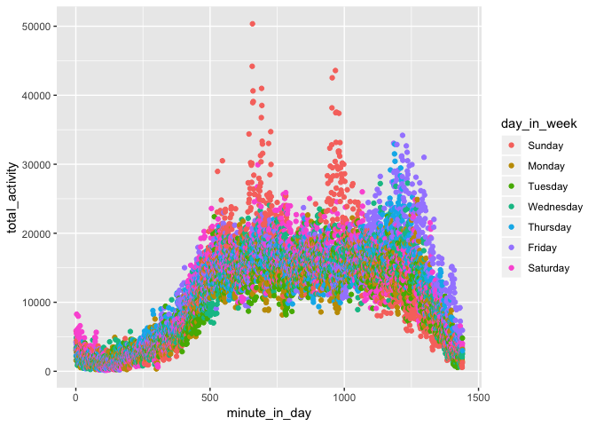
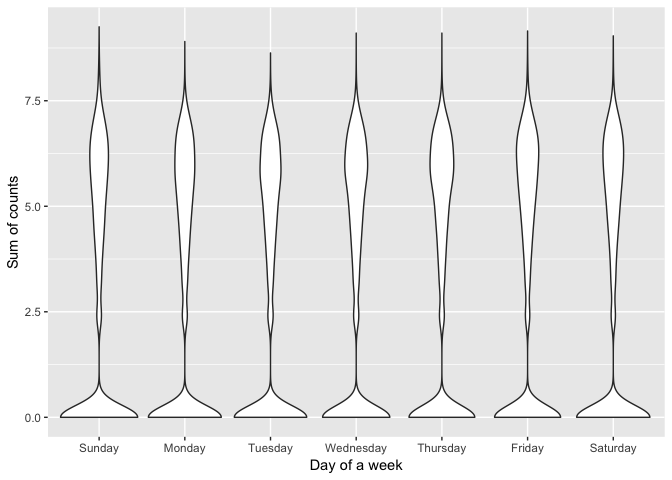

p8105 midterm project
================
Zanis Fang, UID: ZF2213
10/16/2018

### loading data

``` r
# loading data and make to tall table
acc <- read_csv("./data/p8105_mtp_data.csv")
```

    ## Parsed with column specification:
    ## cols(
    ##   .default = col_double(),
    ##   week = col_integer(),
    ##   day = col_character()
    ## )

    ## See spec(...) for full column specifications.

``` r
acc <- acc %>% gather(key = "time_activity", value = "accel", activity.1:activity.1440)
```

the dataset is 1440 recorded activities, one activity every one minutes, across the day.

There are 329 days.

``` r
acc_tidy <- acc %>% 
    # get the "second" of a day
    mutate(time_activity = str_replace(time_activity, "activity.", "")) %>% 
    mutate(time_activity = as.integer(time_activity)) %>% 
    # floor division get minute and hour
    mutate(hour = time_activity %/% 60, minute = time_activity %% 60) %>% 
    # relevel day variable
    mutate(day = forcats::fct_relevel(day, c("Sunday", "Monday", "Tuesday",
                                                                                     "Wednesday", "Thursday", "Friday", "Saturday")))
```

``` r
# activity over all followup period
acc_tidy %>%
    mutate(day_of_year = week * as.integer(day)) %>% 
    group_by(day_of_year) %>% 
    summarize(sum_accel = sum(accel)) %>% 
    ggplot(aes(x = day_of_year, y = sum_accel)) +
      geom_point() +
      labs(
        x = "Day",
        y = "Sum of counts"
      )
```



``` r
# get activity during a day
acc_tidy %>%
    group_by(time_activity) %>% 
    summarize(sum_accel = sum(accel)) %>% 
    ggplot(aes(x = time_activity, y = sum_accel)) +
      geom_point() +
      labs(
        x = "Time of a day",
        y = "Sum of counts"
      )
```



``` r
# get activity during a week
acc_tidy %>%
    ggplot(aes(x = day, y = log(accel))) +
      geom_violin() +
      labs(
        x = "Day of a week",
        y = "Sum of counts"
      )
```



it seems there are two "types" of activity, low intensity activity, such as sleep, sit, etc, and high intensity activity, such as walk, run, climb stairs, etc.
