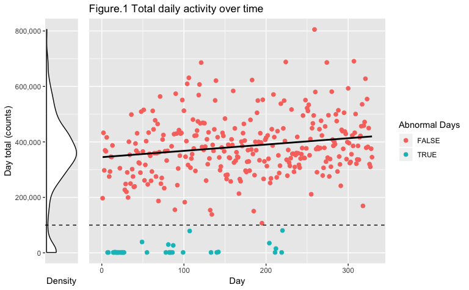
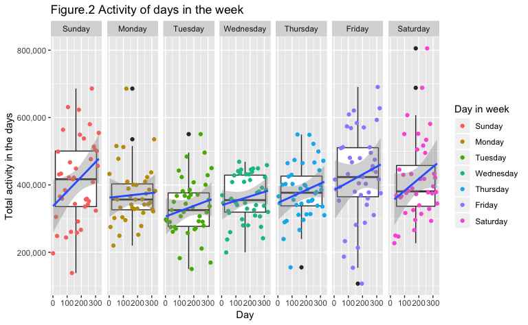
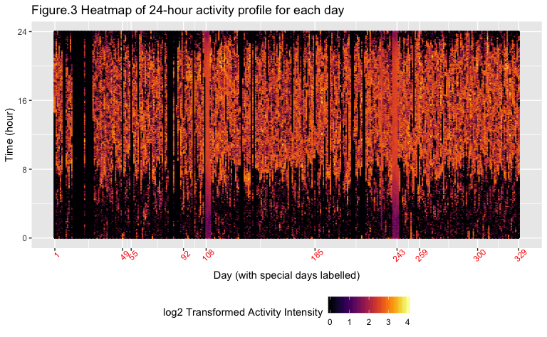
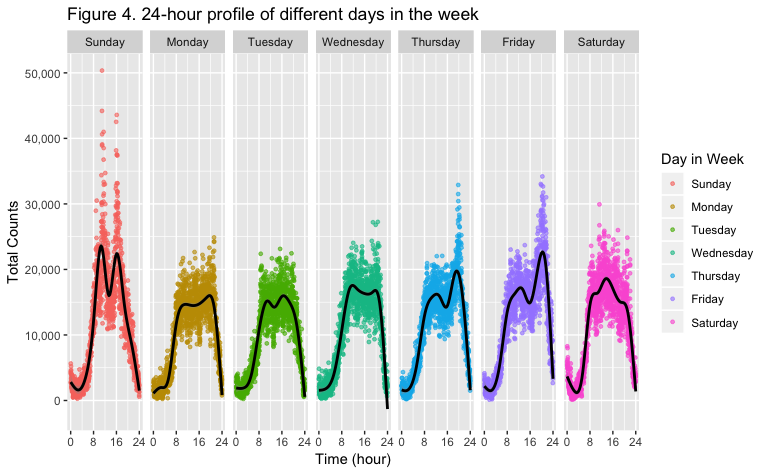
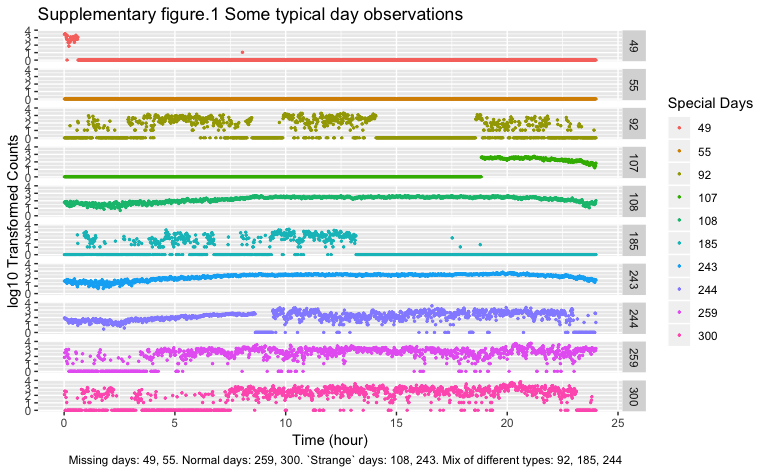

p8105 midterm project
================
Zanis Fang, UID: ZF2213
10/16/2018

## Introduction

Accelerometers have been powerful tools to study personal activities
over a long period of days. Unlike traditional ways of analysis, which
focus mainly on the total activity over the day, analyzing activity over
the course of the day can provide us more detailed information about the
behaviours of the individuals, thus valuable healthcare information.
This project aims at using both ways to analyse the accelerometer
records of a congestive heart failure (CHF) patient, trying to wrangle
valuable behaviour information about the patient.

## Data and Methods

  - Patient information

The patient is a 63-year old male with BMI 25, who was diagnosed with
congestive heart failure at Columbia University Medical Center. Consent
from the patient is assumed since this information has already been
public to whole class.

  - Methods

The methods of this project are using simple r programming skills along
with tidyverse packages to take a look at the activity distribution of
days across whole period, within a day, and across days in a week.

## Results

### Loading and tidying data

Columns are values rather than variables, so the first step to tidying
after loading is gathering the columns into the minutes of the days.
Then rename some variables, make the variables with reasonable data
type, and arrange the columns and rows.

``` r
# loading data and make to tall table
activity <- read_csv("./data/p8105_mtp_data.csv") %>% 
    # gather into long table
    gather(key = "minute_in_day", value = "counts", activity.1:activity.1440) %>% 
    # get the "minute" of a day, 
    mutate(minute_in_day = str_replace(minute_in_day, "activity.", "")) %>% 
    # change to integer
    mutate(minute_in_day = as.integer(minute_in_day)) %>% 
    # make day in week variable factor and relevel the day variable
    rename(day_in_week = day) %>%
    mutate(day_in_week = forcats::fct_relevel(day_in_week, c("Sunday", "Monday",
    "Tuesday", "Wednesday",
    "Thursday", "Friday",
    "Saturday"))) %>% 
    # assuming the start of the first week is Sunday
    mutate(day = (week - 1) * 7 + as.integer(day_in_week)) %>% 
    # arrange the variable
    select(day, week, day_in_week, minute_in_day, counts)
```

After tidying, each row records the day, week, day\_in\_week,
minute\_in\_day, counts of an activity of a minute, there are in total
473760 minutes of 329 days.

### The total activity in each day

``` r
activity_day_total <- activity %>% 
# aggregate across minutes to create total activity
    group_by(day, day_in_week, week) %>% 
    # get total activity in the days
  summarize(day_total = sum(counts))

# necessary package to put two ggplot elements together
library(patchwork)

# density plot of distribution of total activity across days
density_total <- activity_day_total %>% 
    # label the outliers
  group_by(outliers = day_total > 100000) %>% 
    # plot the density plot
    ggplot(aes(x = day_total)) +
      geom_density(fill = "white") +
      # draw a line to label the cutoff
      geom_vline(xintercept = 100000, linetype = 2) +
      # make coordinator flip
      coord_flip() +
      # label axis
      labs(
        x = "Day total (counts)",
        y = "Density"
      ) +
      # ticks labels (before flip)
      scale_x_continuous(labels = scales::comma) +
      scale_y_continuous(breaks = c()) 

# day total counts over time
scatter_total <- activity_day_total %>%
    # group by outliers
    group_by(abnormal_day = day_total < 100000) %>%
    # plot scatterplot
    ggplot(aes(x = day, y = day_total, color = abnormal_day)) +
      # scatterplot
      geom_point(size = 2) +
      # draw a line for cutoff
      geom_hline(yintercept = 100000, linetype = 2) +
      # get regression line for the days (exclude outliers)
      geom_smooth(method = "lm", aes(linetype = abnormal_day), color = "black", show.legend = FALSE, se = FALSE) +
      # labels, ticks, axis, titles, etc...
      scale_linetype_manual(values = c(1, 0)) +
      labs(x = "Day", color = "Abnormal Days", fill = "Abnormal Day",
             title = "Figure.1 Total daily activity over time") +
      theme(
       axis.ticks.y = element_blank(),
       axis.title.y = element_blank(),
       axis.text.y = element_blank()
      )

# put two plots together
density_total + scatter_total + plot_layout(widths = c(0.2, 1.8))
```



It turns out that in some days the total activity are extremely low,
they are actually missing days. We can visually feel the daily total
activity are increasing over time. For statistical analysis, it would be
better to remove NAs before proceeding.

### Linear regression

Null hypothesis: slope is 0. Alternative hypothesis: slope is not equal
to 0. Significance level: 0.01.

``` r
# get linear regression analysis
(stats_day_total <- summary(lm(day ~ day_total,
         data = activity_day_total %>% filter(day_total > 100000))))
```

    ## 
    ## Call:
    ## lm(formula = day ~ day_total, data = activity_day_total %>% filter(day_total > 
    ##     1e+05))
    ## 
    ## Residuals:
    ##      Min       1Q   Median       3Q      Max 
    ## -181.373  -80.065    1.849   75.221  180.467 
    ## 
    ## Coefficients:
    ##              Estimate Std. Error t value Pr(>|t|)    
    ## (Intercept) 1.081e+02  1.998e+01   5.407 1.33e-07 ***
    ## day_total   1.740e-04  5.008e-05   3.475 0.000588 ***
    ## ---
    ## Signif. codes:  0 '***' 0.001 '**' 0.01 '*' 0.05 '.' 0.1 ' ' 1
    ## 
    ## Residual standard error: 90.92 on 293 degrees of freedom
    ## Multiple R-squared:  0.03959,    Adjusted R-squared:  0.03631 
    ## F-statistic: 12.08 on 1 and 293 DF,  p-value: 0.0005877

The p-value of correlation of total activities over time is
0.0005877388. So at 0.01 significance level, we have enough evidence to
reject the null hypothesis and conclude that the patient became more
active over
time.

### The effect of days in a week on total activities.

``` r
# across week, show the distribution of activities for each day in a week
activity_day_total %>%
  # remove outliers
    filter(day_total > 100000) %>% 
    # boxplot of days in week
    ggplot(aes(y = day_total, x = day, group = day_in_week)) +
      # boxplot
      geom_boxplot() +
      # scatterplot
      geom_point(aes(color = day_in_week)) +
      # linear regression line
      geom_smooth(method = lm) +
      # activity for each day in week
      facet_grid(. ~ day_in_week) +
    scale_y_continuous(labels = scales::comma) +
      labs(
        x = "Day",
        y = "Total activity in the days",
        title = "Figure.2 Activity of days in the week",
        color = "Day in week"
      )
```



The patient seems to be most active during Fridays and Sundays, and
least during Tuesdays.

The increases of active during Friday, Saturday and Sunday over time are
more significant that that of the other days in the week, but the trends
are all the same.

### Activities over the course of the day

``` r
# display 24-hour profile for each day using 2d density plot
activity %>%
    # using heatmap to show every minute of each day
    ggplot(aes(y = minute_in_day / 60, x = day, color = log(counts, 10))) +
      # heatmap
      geom_point(size = 0.3, alpha = 0.5) +
      # label special days
      scale_x_continuous(breaks = c(1, 49, 55, 92, 108, 185, 243, 259, 300, 329)) +
        # hours in the days
      scale_y_continuous(breaks = c(0, 8, 16, 24)) +
      # palette
      viridis::scale_color_viridis(
        name = "log2 Transformed Activity Intensity",
        option = "inferno",
        discrete = FALSE
      ) +
      # labels and themes
      labs(
        y = "Time (hour)",
        x = "Day (with special days labelled)",
        title = "Figure.3 Heatmap of 24-hour activity profile for each day"
      ) +
      theme(
        axis.text.x = element_text(color = "red", angle = 45),
        legend.position = "bottom"
      )
```



The patient are active during days and sedatory during night. He seems
to live a regular life.

There seem to be some missing days and some “strange” days with
extremely low variance. Refer to supplementary material for more
information.

### Daily distribution

``` r
activity %>%
    # grouping to get number of a type of activity
    group_by(minute_in_day, day_in_week) %>%
    # get group total (adding the total activity of a single time point in a day across all days would be less sensitive to missing values)
    summarize(total_activity = sum(counts)) %>%
    # plot scatterplot and smoothline 
    ggplot(aes(x = minute_in_day / 60, y = total_activity, color = day_in_week)) +
      # scatterplot
      geom_point(size = 1, alpha = 0.6) +
      # add smoothline
      geom_smooth(color = "black", linetype = 1) +
      # labels and axises
      scale_x_continuous(breaks = c(0, 8, 16, 24)) +
      scale_y_continuous(labels = scales::comma) +
      labs(
        x = "Time (hour)",
        y = "Total Counts",
        color = "Day in Week",
        title = "Figure 4. 24-hour profile of different days in the week"
      ) + 
      # get the 24-hour profile for each day of the week
      facet_grid(. ~ day_in_week)
```

    ## `geom_smooth()` using method = 'gam' and formula 'y ~ s(x, bs = "cs")'



The patient seems to be quite active during Friday and weekends. For
some reasons, there are activity peaks during Thursday and Friday
nights, and two peaks in Sundays.

## Discussion

To summarize, the accelerometer data provides observations of many
aspects of daily activity of a patient. Wrangling more sophisticated
information from this dataset requires more advanced statistics
knowledge and programming skills.

## Supplementary material

``` r
# some feature days
activity %>% 
    # get some days as examples
  filter(day %in% c(0, 49, 55, 92, 107:108, 185, 243, 244, 259, 300)) %>%
    # plot scatterplot for each days
    ggplot(aes(y = log10(counts), x = minute_in_day / 60, color = as.factor(day))) +
      # scatterplot
      geom_point(size = 0.5) +
      # one plot for each day
      facet_grid(day ~ .) +
      # labels
      labs(x = "Time (hour)",
             y = "log10 Transformed Counts",
             color = "Special Days",
             title = "Supplementary figure.1 Some typical day observations",
             caption = "Missing days: 49, 55. Normal days: 259, 300. `Strange` days: 108, 243. Mix of different types: 92, 185, 244")
```


