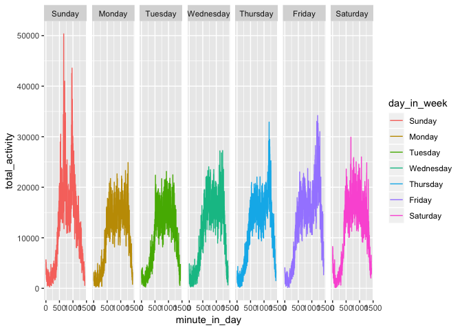

p8105 midterm project
================
Zanis Fang, UID: ZF2213
10/16/2018

**three or four figures would be enough**

### loading data

Columns are values rather than variables, load data and gather the columns

The dataset records every minute in a day. There are in total 329 days.

(Write more about dataset, make variable name more reasonable)

### Data tidying

``` r
# loading data and make to tall table
activity <- read_csv("./data/p8105_mtp_data.csv") %>% 
    # gather into long table
    gather(key = "minute_in_day", value = "counts", activity.1:activity.1440) %>% 
    # get the "minute" of a day, 
    mutate(minute_in_day = str_replace(minute_in_day, "activity.", "")) %>% 
    # change to integer
    mutate(minute_in_day = as.integer(minute_in_day)) %>% 
    # make day in week variable factor and relevel the day variable
    rename(day_in_week = day) %>%
    mutate(day_in_week = forcats::fct_relevel(day_in_week, c("Sunday", "Monday",
                                                                                                                     "Tuesday", "Wednesday",
                                                                                                                     "Thursday", "Friday",
                                                                                                                     "Saturday"))) %>% 
    # assuming the start of the first week is Sunday
    mutate(day = (week - 1) * 7 + as.integer(day_in_week)) %>% 
    # arrange the variable
    select(day, week, day_in_week, minute_in_day, counts)
```

    ## Parsed with column specification:
    ## cols(
    ##   .default = col_double(),
    ##   week = col_integer(),
    ##   day = col_character()
    ## )

    ## See spec(...) for full column specifications.

### Across the day

``` r
activity_day_total <- activity %>% 
# aggregate across minutes to create total activity
    group_by(day, day_in_week, week) %>% 
  summarize(day_total = sum(counts))

# day total counts over time
activity_day_total %>%
    ggplot(aes(x = day, y = day_total)) +
      geom_line() +
      geom_smooth()
```

    ## `geom_smooth()` using method = 'loess' and formula 'y ~ x'


``` r
# distribution of day total in every day in week
activity_day_total %>%
    ggplot(aes(x = day_in_week, y = day_total)) +
      geom_boxplot()
```


``` r
# across week, show the distribution of activities for each day in a week
activity_day_total %>%
    ggplot(aes(y = day_total, x = day, color = day_in_week)) +
      geom_point() +
      geom_smooth() +
      facet_grid(. ~ day_in_week)
```

    ## `geom_smooth()` using method = 'loess' and formula 'y ~ x'

 (add some statistical parts)

### Activities over a day

``` r
# display 24-hour profile for each day using 2d density plot
activity %>%
    ggplot(aes(x = minute_in_day, y = day, color = log10(counts))) +
      geom_point(size = 0.1, alpha = 0.5) +
      viridis::scale_color_viridis(
        name = "Location",
        discrete = FALSE
      )
```


### Get distribution of the data

``` r
# take a look at activity distribution
activity %>% ggplot(aes(x = counts)) +
    geom_density() +
    scale_x_log10(breaks = 2^c(1:12)) +
    theme(axis.text.x = element_text(angle = 90))
```


It would be unreasonable to take the average of signals across time.

It seems there are two "types" of activity, low intensity activity, such as sleep, sit, etc, and high intensity activity, such as walk, run, climb stairs, etc. And there is a middle type activity. However, the middle type of activities are low in number, so merge it into high intensity activity. Actually, the high intensity activities are wide in range.

The following analysis are based on these two types of activities.

``` r
# subgroup range of activity 
activity <- activity %>%
    mutate(activity_type = cut(counts, c(0, 8, Inf), labels = c("sedentary", "active"))) 

activity %>% count(activity_type)
```

    ## # A tibble: 2 x 2
    ##   activity_type      n
    ##   <fct>          <int>
    ## 1 sedentary     204542
    ## 2 active        269218

``` r
activity %>%
    # grouping to get number of a type of activity
    group_by(minute_in_day, day_in_week) %>%
    summarize(total_activity = sum(counts)) %>%
    ggplot(aes(x = minute_in_day, y = total_activity, color = day_in_week)) +
      geom_point()
```


``` r
activity %>%
    # grouping to get number of a type of activity
    group_by(minute_in_day, day_in_week) %>%
    summarize(total_activity = sum(counts)) %>%
    ggplot(aes(x = minute_in_day, y = total_activity, color = day_in_week)) +
      geom_line() +
      facet_grid(. ~ day_in_week) 
```



``` r
# percentage of time remains sedentary during certain time in a day
activity %>%
    # grouping to get number of a type of activity
    group_by(minute_in_day, day_in_week, activity_type) %>%
    summarize(n_of_activity = n()) %>%
    # use 0 to fill blank cell
    spread(key = activity_type, value = n_of_activity, fill = 0) %>% 
    mutate(prop_active = active / (sedentary + active)) %>% 
    ggplot(aes(x = minute_in_day, y = prop_active)) +
      geom_line() +
      geom_smooth() +
      facet_grid(. ~ day_in_week)
```

    ## `geom_smooth()` using method = 'gam' and formula 'y ~ s(x, bs = "cs")'


``` r
# across a day
activity %>%
    # group by the minute in a day and type of activity
    group_by(minute_in_day, activity_type) %>%
    # sum of activities for the same minute over all days
    summarize(sum_activity = sum(counts)) %>%
    #normalize against mean of group total activities
    group_by(activity_type) %>% 
    mutate(group_mean = mean(sum_activity)) %>%
    # normalize against the average of each type of activities
    ggplot(aes(x = minute_in_day, y = sum_activity / group_mean, color = activity_type)) +
      geom_line()
```


``` r
# 
# # across day + week, mean
# activity %>%
#   group_by(minute_in_day, day_of_week, activity_type) %>% 
#   summarize(sum_activity = sum(counts)) %>%
#   group_by(activity_type) %>% 
#   # get mean of sum_activity for each group for normalization
#   mutate(group_mean = mean(sum_activity)) %>% 
#   ggplot(aes(x = time_activity, y = sum_activity / group_mean, color = range_accel)) +
#     geom_line() +
#     facet_grid(range_accel ~ day)


# 
# acc %>%
#   ggplot(aes(x = time_activity, y = week, color = log10(accel))) +
#     geom_point(size = 0.1, alpha = 0.5) +
#     facet_grid(day ~ .) +
#     viridis::scale_color_viridis(
#       name = "Location",
#       discrete = FALSE
#     )
# 
# # across day of the period
# acc %>%
#   group_by(day_of_period, day, range_accel) %>% 
#   summarize(sum_activity = sum(accel)) %>% 
#   group_by(range_accel) %>% 
#   # mean of sum of group
#   mutate(group_mean = mean(sum_activity)) %>%
#   ggplot(aes(x = day_of_period, y = sum_activity / group_mean, color = range_accel)) +
#     geom_line() +
#     geom_smooth() +
#     facet_grid(range_accel ~ .)
# 
# # across week
# acc %>%
#   group_by(day, range_accel) %>%
#   summarize(sum_activity = sum(accel)) %>%
#   group_by(range_accel) %>% 
#   mutate(group_mean = mean(sum_activity)) %>% 
#   ggplot(aes(x = day, y = sum_activity / group_mean, group = range_accel, color = range_accel)) +
#     geom_line()
# 
# # across week, show the distribution of activities for each day in a week
# acc %>%
#   ggplot(aes(y = log(accel), color = day)) +
#     geom_boxplot() +
#     facet_grid(range_accel ~ .)
# 
# 
# # across day of the period + week, mean
# acc %>%
#   group_by(day_of_period, day, range_accel) %>% 
#   summarize(sum_activity = sum(accel)) %>%
#   group_by(range_accel) %>% 
#   # get mean of sum_activity for each group for normalization
#   mutate(group_mean = mean(sum_activity)) %>% 
#   ggplot(aes(x = day_of_period, y = sum_activity / group_mean, color = range_accel)) +
#     geom_line() +
#     geom_smooth() +
#     facet_grid(range_accel ~ day)
```
