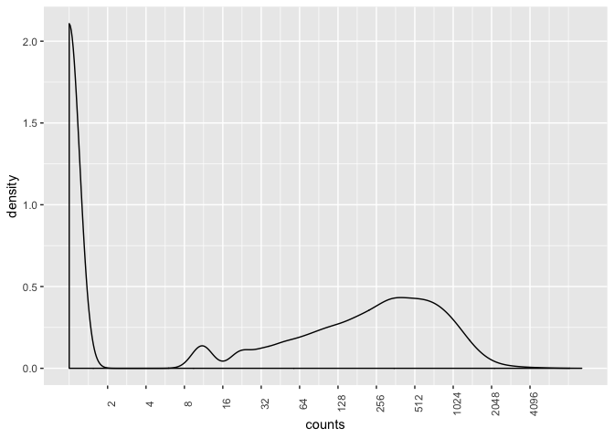
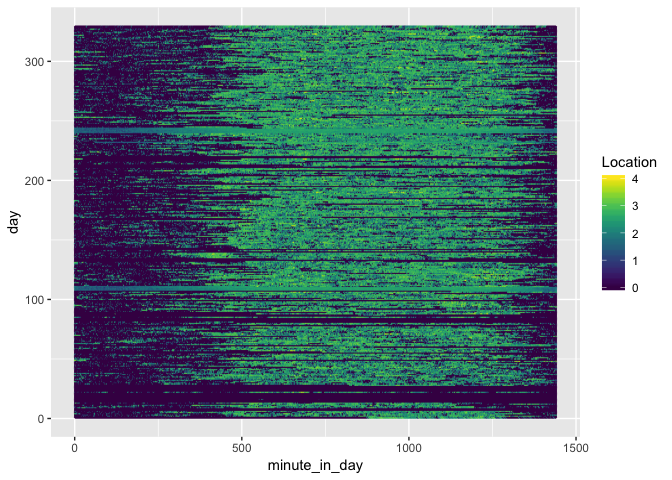
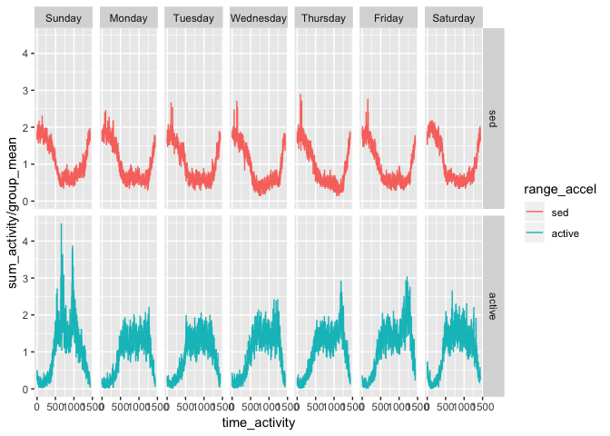
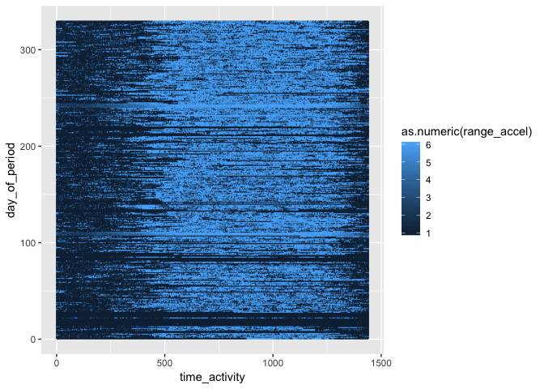
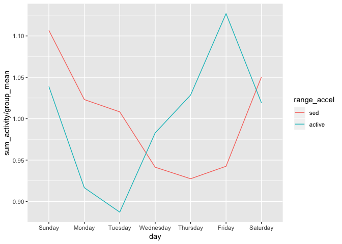

p8105 midterm project
================
Zanis Fang, UID: ZF2213
10/16/2018

**three or four figures would be enough**

### loading data

Columns are values rather than variables, load data and gather the columns

``` r
# loading data and make to tall table
acc <- read_csv("./data/p8105_mtp_data.csv") %>% 
    # gather into long table
    gather(key = "time_activity", value = "accel", activity.1:activity.1440)
```

    ## Parsed with column specification:
    ## cols(
    ##   .default = col_double(),
    ##   week = col_integer(),
    ##   day = col_character()
    ## )

    ## See spec(...) for full column specifications.

The dataset records every minute in a day. There are in total 329 days.

### Data tidying

1.  Get the nth minute of a day

``` r
# do some tidy
acc <- acc %>% 
    # get the "minute" of a day, 
    mutate(time_activity = str_replace(time_activity, "activity.", "")) %>% 
    # change to integer
    mutate(time_activity = as.integer(time_activity)) %>% 
    # floor division get hour:minute of each day
    mutate(hour = time_activity %/% 60, minute = time_activity %% 60) %>% 
    # make day variable factor and relevel the day variable
    mutate(day = forcats::fct_relevel(day, c("Sunday", "Monday", "Tuesday",
                                                                                     "Wednesday", "Thursday",
                                                                                     "Friday", "Saturday"))) %>% 
    # assuming the start of the first week is Sunday
    mutate(day_of_period = (week - 1) * 7 + as.integer(day))
```

### Get distribution of the data

``` r
# take a look at activity distribution
acc %>% ggplot(aes(x = accel)) +
    geom_density() +
    scale_x_log10(breaks = 2^c(1:12)) +
    theme(axis.text.x = element_text(angle = 90))
```



It would be unreasonable to take the average of signals across time.

It seems there are two "types" of activity, low intensity activity, such as sleep, sit, etc, and high intensity activity, such as walk, run, climb stairs, etc. And there is a middle type activity. However, the middle type of activities are low in number, so merge it into high intensity activity. Actually, the high intensity activities are wide in range.

The following analysis are based on these three types of activities.

### Activities over a day

``` r
# subgroup range of activity 
acc <- acc %>% mutate(range_accel = cut(accel, c(0, 8, Inf), labels = c("sed", "active"))) 
acc %>% count(range_accel)
```

    ## # A tibble: 2 x 2
    ##   range_accel      n
    ##   <fct>        <int>
    ## 1 sed         204542
    ## 2 active      269218

``` r
# across a day
acc %>%
    group_by(time_activity, range_accel) %>%
    # sum of activities may be more meaningful
    summarize(sum_activity = sum(accel)) %>%
    group_by(range_accel) %>% 
    mutate(group_mean = mean(sum_activity)) %>%
    # normalize against the average of each type of activities
    ggplot(aes(x = time_activity, y = sum_activity / group_mean, color = range_accel)) +
      geom_line() +
      facet_grid(range_accel ~ .)
```



``` r
# across day + week, mean
acc %>%
    group_by(time_activity, day, range_accel) %>% 
    summarize(sum_activity = sum(accel)) %>%
    group_by(range_accel) %>% 
    # get mean of sum_activity for each group for normalization
    mutate(group_mean = mean(sum_activity)) %>% 
    ggplot(aes(x = time_activity, y = sum_activity / group_mean, color = range_accel)) +
      geom_line() +
      facet_grid(range_accel ~ day)
```



``` r
# display activities each day using 2d density plot
acc %>%
    mutate(range_accel = cut(accel, c(0, 8, 32, 64, 128, 256, Inf), labels = c(1:6))) %>% 
    ggplot(aes(x = time_activity, y = day_of_period, color = as.numeric(range_accel))) +
      geom_point(size = 0.1, alpha = 0.5)
```



``` r
# across day of the period
acc %>%
    group_by(day_of_period, day, range_accel) %>% 
    summarize(sum_activity = sum(accel)) %>% 
    group_by(range_accel) %>% 
    # mean of sum of group
    mutate(group_mean = mean(sum_activity)) %>%
    ggplot(aes(x = day_of_period, y = sum_activity / group_mean, color = range_accel)) +
      geom_line() +
      geom_smooth() +
      facet_grid(range_accel ~ .)
```

    ## `geom_smooth()` using method = 'loess' and formula 'y ~ x'


``` r
# across week
acc %>%
    group_by(day, range_accel) %>%
    summarize(sum_activity = sum(accel)) %>%
    group_by(range_accel) %>% 
    mutate(group_mean = mean(sum_activity)) %>% 
    ggplot(aes(x = day, y = sum_activity / group_mean, group = range_accel, color = range_accel)) +
      geom_line()
```



``` r
# across week, show the distribution of activities for each day in a week
acc %>%
    ggplot(aes(x = log(accel), color = day)) +
      geom_density()
```


``` r
# across day of the period + week, mean
acc %>%
    group_by(day_of_period, day, range_accel) %>% 
    summarize(sum_activity = sum(accel)) %>%
    group_by(range_accel) %>% 
    # get mean of sum_activity for each group for normalization
    mutate(group_mean = mean(sum_activity)) %>% 
    ggplot(aes(x = day_of_period, y = sum_activity / group_mean, color = range_accel)) +
      geom_line() +
      geom_smooth() +
      facet_grid(range_accel ~ day)
```

    ## `geom_smooth()` using method = 'loess' and formula 'y ~ x'


