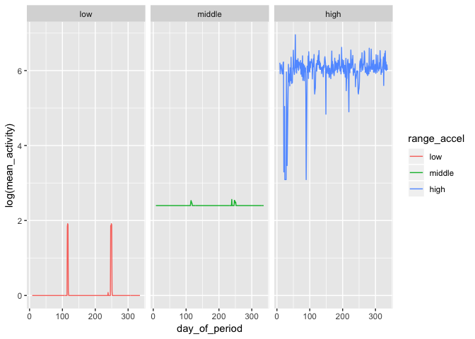
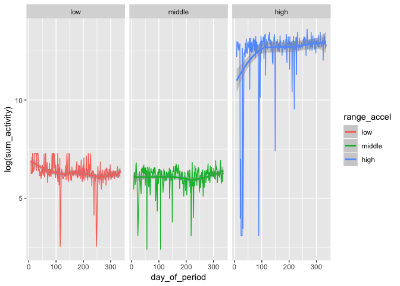

p8105 midterm project
================
Zanis Fang, UID: ZF2213
10/16/2018

### loading data

``` r
# loading data and make to tall table
acc <- read_csv("./data/p8105_mtp_data.csv")
```

    ## Parsed with column specification:
    ## cols(
    ##   .default = col_double(),
    ##   week = col_integer(),
    ##   day = col_character()
    ## )

    ## See spec(...) for full column specifications.

``` r
acc <- acc %>% gather(key = "time_activity", value = "accel", activity.1:activity.1440)
```

the dataset is 1440 recorded activities, one activity every one minutes, across the day.

There are 329 days.

``` r
# do some tidy
acc_tidy <- acc %>% 
    # get the "second" of a day
    mutate(time_activity = str_replace(time_activity, "activity.", "")) %>% 
    mutate(time_activity = as.integer(time_activity)) %>% 
    # floor division get minute and hour
    mutate(hour = time_activity %/% 60, minute = time_activity %% 60) %>% 
    # relevel day variable
    mutate(day = forcats::fct_relevel(day, c("Sunday", "Monday", "Tuesday",
                                                                                     "Wednesday", "Thursday", "Friday", "Saturday"))) %>% 
    mutate(day_of_period = (week - 1) * 7 + as.integer(day))
```

``` r
# activity over all followup period
acc_tidy %>% 
    group_by(day_of_period) %>% 
    summarize(sum_accel = sum(accel)) %>% 
    ggplot(aes(x = day_of_period, y = sum_accel)) +
      geom_point() +
      labs(
        x = "Day",
        y = "Sum of counts"
      )
```


``` r
# take a look at activity distribution
acc_tidy %>% ggplot(aes(x = accel)) +
    geom_density() +
    scale_x_log10(breaks = 2^c(1:12)) +
    theme(axis.text.x = element_text(angle = 90))
```


it seems there are two "types" of activity, low intensity activity, such as sleep, sit, etc, and high intensity activity, such as walk, run, climb stairs, etc.

``` r
# across a day, log, mean
acc_tidy %>%
    group_by(time_activity) %>% 
    summarize(mean_activity = mean(accel)) %>% 
    ggplot(aes(x = time_activity, y = log(mean_activity))) +
      geom_line()
```


``` r
# across a day, mean
acc_tidy %>%
    group_by(time_activity) %>% 
    summarize(mean_activity = mean(accel)) %>% 
    ggplot(aes(x = time_activity, y = mean_activity)) +
      geom_line()
```


``` r
# across day of period
acc_tidy %>%
    group_by(day_of_period) %>% 
    summarize(mean_activity = mean(accel), sum_activity = sum(accel)) %>%
    gather(key = "type", value = "accel", mean_activity, sum_activity) %>%
    ggplot(aes(x = day_of_period, y = accel, color = type)) +
      geom_line() +
      geom_smooth()
```

    ## `geom_smooth()` using method = 'loess' and formula 'y ~ x'


``` r
# subgroup range of activity 
acc_subgroup <- acc_tidy %>% mutate(range_accel = cut(accel, c(0, 8, 16, Inf),
                                                                            labels = c("low", "middle", "high")),
                                                                        day_of_period = as.integer(day) + week * 7
                                                                        ) 

# across a day, mean
acc_subgroup %>%
    group_by(time_activity, range_accel) %>% 
    summarize(mean_activity = mean(accel)) %>% 
    ggplot(aes(x = time_activity, y = log(mean_activity), group = range_accel, color = range_accel)) +
      geom_line() +
      facet_grid(. ~ range_accel)
```


``` r
# middle and low fraction are fluctrating

# across day of the period, mean
acc_subgroup %>%
    group_by(day_of_period, range_accel) %>% 
    summarize(mean_activity = mean(accel)) %>% 
    ggplot(aes(x = day_of_period, y = log(mean_activity), group = range_accel, color = range_accel)) +
      geom_line() +
      facet_grid(. ~ range_accel)
```


``` r
# across day of the period, sum
acc_subgroup %>%
    group_by(day_of_period, range_accel) %>% 
    summarize(sum_activity = sum(accel)) %>% 
    ggplot(aes(x = day_of_period, y = log(sum_activity), group = range_accel, color = range_accel)) +
      geom_line() +
      geom_smooth() +
      facet_grid(. ~ range_accel)
```

    ## `geom_smooth()` using method = 'loess' and formula 'y ~ x'


``` r
# across day of the period, sum not log
acc_subgroup %>%
    group_by(day_of_period, range_accel) %>% 
    summarize(sum_activity = sum(accel)) %>% 
    ggplot(aes(x = day_of_period, y = sum_activity, group = range_accel, color = range_accel)) +
      geom_line() +
      geom_smooth() +
      facet_grid(. ~ range_accel)
```

    ## `geom_smooth()` using method = 'loess' and formula 'y ~ x'



``` r
# across week
acc_subgroup %>%
    group_by(day, range_accel) %>% 
    summarize(sum_activity = sum(accel)) %>% 
    ggplot(aes(x = day, y = sum_activity, group = range_accel, color = range_accel)) +
      geom_line() +
      geom_smooth() +
      facet_grid(. ~ range_accel)
```

    ## `geom_smooth()` using method = 'loess' and formula 'y ~ x'



``` r
# across week X day
acc_subgroup %>%
    group_by(day, day_of_period, range_accel) %>% 
    summarize(sum_activity = sum(accel)) %>% 
    ggplot(aes(x = day_of_period, y = sum_activity, group = range_accel, color = range_accel)) +
      geom_line() +
      geom_smooth() +
      facet_grid(. ~ day)
```

    ## `geom_smooth()` using method = 'loess' and formula 'y ~ x'


