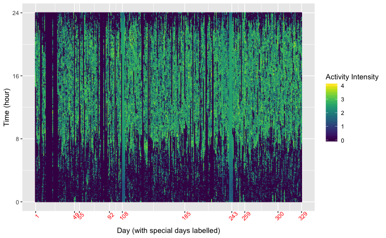

p8105 midterm project
================
Zanis Fang, UID: ZF2213
10/16/2018

## Introduction

Accelerometers have been powerful tools to study personal activities
over a long period of days. Unlike traditional ways of analysis, which
focus mainly on the total activity over the day, analyzing activity over
the course of the day can provide us more detailed information about the
behaviours of the individuals, thus valuable healthcare information.
This project aims at using both ways to analyse the accelerometer
records of a congestive heart failure (CHF) patient, trying to wrangle
valuable behaviour information about the patient.

## Methods

The patient is a 63-year old male with BMI 25, who was diagnosed with
congestive heart failure.

Consent from the patient is assumed since this information has been
public to whole class.

The purpose of this projects is using simple r programming with
tidyverse packages to take a look at

### loading data

Columns are values rather than variables, load data and gather the
columns

The dataset records every minute in a day. There are in total 329 days.

(Write more about dataset, make variable name more reasonable)

### Data tidying

``` r
# loading data and make to tall table
activity <- read_csv("./data/p8105_mtp_data.csv") %>% 
    # gather into long table
    gather(key = "minute_in_day", value = "counts", activity.1:activity.1440) %>% 
    # get the "minute" of a day, 
    mutate(minute_in_day = str_replace(minute_in_day, "activity.", "")) %>% 
    # change to integer
    mutate(minute_in_day = as.integer(minute_in_day)) %>% 
    # make day in week variable factor and relevel the day variable
    rename(day_in_week = day) %>%
    mutate(day_in_week = forcats::fct_relevel(day_in_week, c("Sunday", "Monday",
                                                                                                                     "Tuesday", "Wednesday",
                                                                                                                     "Thursday", "Friday",
                                                                                                                     "Saturday"))) %>% 
    # assuming the start of the first week is Sunday
    mutate(day = (week - 1) * 7 + as.integer(day_in_week)) %>% 
    # arrange the variable
    select(day, week, day_in_week, minute_in_day, counts)
```

## Results

### Across the day

``` r
activity_day_total <- activity %>% 
# aggregate across minutes to create total activity
    group_by(day, day_in_week, week) %>% 
  summarize(day_total = sum(counts))

# the distribution of total activity in a day looks as this. However, there are some outliers that should not include in 

library(patchwork)

density_total <- activity_day_total %>% 
  group_by(outliers = day_total > 100000) %>% 
    ggplot(aes(x = day_total)) +
      geom_density(alpha = 0.3) +
      geom_vline(xintercept = 100000, linetype = 2) +
      coord_flip() +
      labs(
        x = "Day total (counts)",
        y = "Density"
      ) +
      scale_x_continuous(labels = scales::comma) +
      theme(
        axis.text.x = element_blank(),
        axis.ticks.x = element_blank()
      )

# day total counts over time
scatter_total <- activity_day_total %>%
    group_by(abnormal_day = day_total < 100000) %>%
    ggplot(aes(x = day, y = day_total, color = abnormal_day)) +
      geom_point(size = 2) +
      geom_hline(yintercept = 100000, linetype = 2) +
      geom_smooth(method = "lm", aes(linetype = abnormal_day), color = "black", show.legend = FALSE, se = FALSE) +
      scale_linetype_manual(values = c(1, 0)) +
      labs(x = "Day", color = "Abnormal Days", fill = "Abnormal Day") +
      theme(
       axis.ticks.y = element_blank(),
       axis.title.y = element_blank(),
       axis.text.y = element_blank()
      )

density_total + scatter_total
```


As you can see in the

``` r
summary(lm(day ~ day_total,
         data = activity_day_total %>% filter(day_total > 100000)))
```

    ## 
    ## Call:
    ## lm(formula = day ~ day_total, data = activity_day_total %>% filter(day_total > 
    ##     1e+05))
    ## 
    ## Residuals:
    ##      Min       1Q   Median       3Q      Max 
    ## -181.373  -80.065    1.849   75.221  180.467 
    ## 
    ## Coefficients:
    ##              Estimate Std. Error t value Pr(>|t|)    
    ## (Intercept) 1.081e+02  1.998e+01   5.407 1.33e-07 ***
    ## day_total   1.740e-04  5.008e-05   3.475 0.000588 ***
    ## ---
    ## Signif. codes:  0 '***' 0.001 '**' 0.01 '*' 0.05 '.' 0.1 ' ' 1
    ## 
    ## Residual standard error: 90.92 on 293 degrees of freedom
    ## Multiple R-squared:  0.03959,    Adjusted R-squared:  0.03631 
    ## F-statistic: 12.08 on 1 and 293 DF,  p-value: 0.0005877

``` r
# across week, show the distribution of activities for each day in a week
activity_day_total %>%
    filter(day_total > 100000) %>% 
    ggplot(aes(y = day_total, x = day, group = day_in_week)) +
      geom_boxplot() +
      geom_point(aes(color = day_in_week)) +
      geom_smooth(method = lm) +
      facet_grid(. ~ day_in_week)
```


### Activities over a day

``` r
# display 24-hour profile for each day using 2d density plot
activity %>%
    ggplot(aes(y = minute_in_day / 60, x = day, color = log10(counts))) +
      geom_point(size = 0.1, alpha = 0.5) +
      scale_x_continuous(breaks = c(1, 49, 55, 92, 108, 185, 243, 259, 300, 329)) +
        scale_y_continuous(breaks = c(0, 8, 16, 24)) +
      viridis::scale_color_viridis(
        name = "Activity Intensity",
        discrete = FALSE
      ) +
      labs(
        y = "Time (hour)",
        x = "Day (with special days labelled)"
      ) +
      theme(
        axis.text.x = element_text(color = "red", angle = 45)
      )
```



``` r
# refer to supplementary material for special days
```

### Daily distribution

``` r
activity %>%
    # grouping to get number of a type of activity
    group_by(minute_in_day, day_in_week) %>%
    summarize(total_activity = sum(counts)) %>%
    ggplot(aes(x = minute_in_day / 60, y = total_activity, color = day_in_week)) +
      geom_point(size = 1, alpha = 0.6) +
      geom_smooth(color = "black", linetype = 1) +
      scale_x_continuous(breaks = c(0, 8, 16, 24)) +
      scale_y_continuous(labels = scales::comma) +
      labs(
        x = "Time (hour)",
        y = "Total Counts",
        color = "Day in Week"
      ) + 
      facet_grid(. ~ day_in_week)
```

    ## `geom_smooth()` using method = 'gam' and formula 'y ~ s(x, bs = "cs")'


## Discussion

## Supplementary material

``` r
# some feature days
activity %>% 
  filter(day %in% c(0, 49, 55, 92, 107:108, 185, 243, 244, 259, 300)) %>%
    ggplot(aes(y = log10(counts), x = minute_in_day / 60, color = as.factor(day))) +
      geom_point(size = 0.5) +
      facet_grid(day ~ .) +
      labs(x = "Time (hour)", y = "log10 Transformed Counts", color = "Special Days")
```


