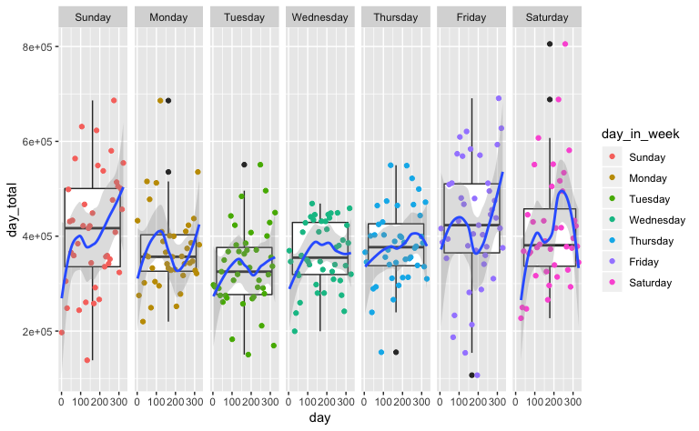
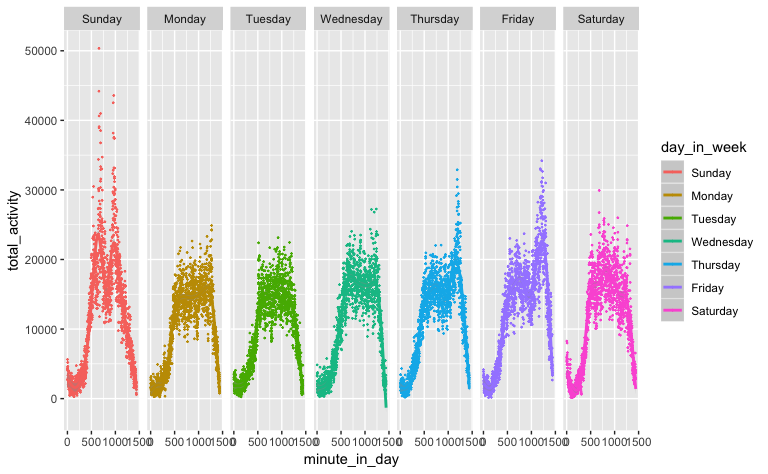

p8105 midterm project
================
Zanis Fang, UID: ZF2213
10/16/2018

**three or four figures would be enough**

### loading data

Columns are values rather than variables, load data and gather the
columns

The dataset records every minute in a day. There are in total 329 days.

(Write more about dataset, make variable name more reasonable)

### Data tidying

``` r
# loading data and make to tall table
activity <- read_csv("./data/p8105_mtp_data.csv") %>% 
    # gather into long table
    gather(key = "minute_in_day", value = "counts", activity.1:activity.1440) %>% 
    # get the "minute" of a day, 
    mutate(minute_in_day = str_replace(minute_in_day, "activity.", "")) %>% 
    # change to integer
    mutate(minute_in_day = as.integer(minute_in_day)) %>% 
    # make day in week variable factor and relevel the day variable
    rename(day_in_week = day) %>%
    mutate(day_in_week = forcats::fct_relevel(day_in_week, c("Sunday", "Monday",
                                                                                                                     "Tuesday", "Wednesday",
                                                                                                                     "Thursday", "Friday",
                                                                                                                     "Saturday"))) %>% 
    # assuming the start of the first week is Sunday
    mutate(day = (week - 1) * 7 + as.integer(day_in_week)) %>% 
    # arrange the variable
    select(day, week, day_in_week, minute_in_day, counts)
```

    ## Parsed with column specification:
    ## cols(
    ##   .default = col_double(),
    ##   week = col_integer(),
    ##   day = col_character()
    ## )

    ## See spec(...) for full column specifications.

### Across the day

``` r
activity_day_total <- activity %>% 
# aggregate across minutes to create total activity
    group_by(day, day_in_week, week) %>% 
  summarize(day_total = sum(counts))

# day total counts over time
activity_day_total %>%
    ggplot(aes(x = day, y = day_total)) +
      geom_point(aes(color = day_in_week)) +
      geom_smooth(method = lm)
```


``` r
# distribution of day total in every day in week
activity_day_total %>%
    ggplot(aes(x = day_in_week, y = day_total)) +
      geom_boxplot()
```



``` r
# across week, show the distribution of activities for each day in a week
activity_day_total %>%
    ggplot(aes(y = day_total, x = day, color = day_in_week)) +
      geom_point() +
      geom_smooth() +
      facet_grid(. ~ day_in_week)
```

    ## `geom_smooth()` using method = 'loess' and formula 'y ~ x'


(add some statistical parts)

### Activities over a day

``` r
# display 24-hour profile for each day using 2d density plot
activity %>%
    ggplot(aes(y = minute_in_day, x = day, color = log10(counts))) +
      geom_point(size = 0.1, alpha = 0.5) +
      scale_x_continuous(breaks = c(1, 55, 92, 107, 185, 243, 300, 329)) +
      viridis::scale_color_viridis(
        name = "Location",
        discrete = FALSE
      )
```


``` r
# refer to supplementary material for special days
```

### Daily distribution

``` r
activity %>%
    # grouping to get number of a type of activity
    group_by(minute_in_day, day_in_week) %>%
    summarize(total_activity = sum(counts)) %>%
    ggplot(aes(x = minute_in_day, y = total_activity, color = day_in_week)) +
      geom_point()
```


``` r
activity %>%
    # grouping to get number of a type of activity
    group_by(minute_in_day, day_in_week) %>%
    summarize(total_activity = sum(counts)) %>%
    ggplot(aes(x = minute_in_day, y = total_activity, color = day_in_week)) +
      geom_point() +
      facet_grid(. ~ day_in_week) 
```



### Supplementary material

``` r
# some feature days
activity %>% 
  filter(day %in% c(0, 55, 92, 107:108, 185, 243, 244, 300)) %>%
    ggplot(aes(y = log10(counts), x = minute_in_day, color = as.factor(day))) +
      geom_point(size = 0.5) +
      facet_grid(day ~ .)
```


